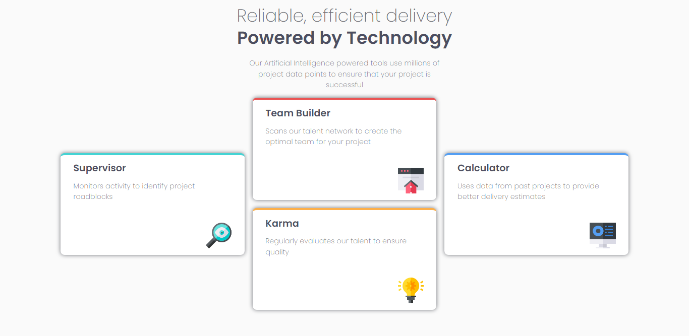

# Four Card Feature Grid

This is one of the Newbie level challenges on Frontendmentor.io. A simple four
grid with some alignment lessons.

**Link to project:** https://fem-four-card-project.vercel.app/ **Link to the
challenge on Fem:**

## How It's Made:

**Tech used:** HTML, CSS GRID, SCSS

This entire project was to learn and practice CSS Grid, so, using Grid I created
the four boxes and usedd a wrapper in the center two to creat the stacked on
Desktop version, this was something I had not realised I needed to do, so it was
a good "Aha" moment for me to do it. I made sure to try and use semantic tags
where they would be needed as well.

## Optimizations

- The scroll on the page, I would like to change this to have it all on the page
  without the need for a scroll bar.
- I think it would be very aesthetic to include a toggle to **dark mode** just
  to have an option, because as is the color is very bright and that can be hard
  to look at.
- Small adjustments to the `font-size`, at the moment on mobile the header text,
  depending on size looks a bit too large.
- The interim values between desktop view (4 col) and mobile view (stacked), I
  would like to add a grid between for tablet views that would be more
  aesthetically pleasing. Having a four grid, two columns, two rows.

## Lessons Learned:

I learned how to use a wrapper to achieve the stacked look in the center two
grid items, I had been a bit confused by that. I also got to use Grid and learn
more about how grid alignments work, as well the different ways to set space
with grid. The `autofit` is probably now one of my favourite values.
